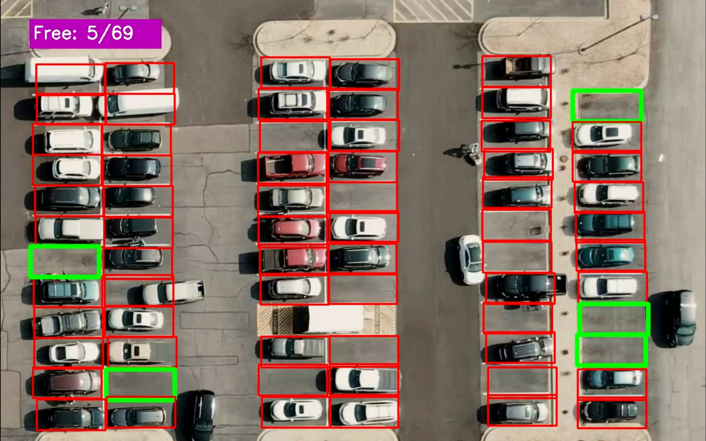

# Car Parking Detection

This project automatically detects and counts empty and occupied parking spaces in a parking lot using digital image processing techniques with OpenCV.

## Installation

1. **Clone the repository:**
   ```bash
   git clone https://github.com/aaanishaaa/OpenCV_parking
   ```
2. **Navigate to the cloned folder:**
   ```bash
   cd car-parking-finder
   ```
3. **Upgrade `pip`:**
   ```bash
   pip install --upgrade pip
   ```
4. **Install dependencies:**
   ```bash
   pip install -r requirements.txt
   ```
5. **Run the application:**
   ```bash
   python app.py
   ```

## Example Results

<p align="center">

</p>

## Problem Definition

The objective of this project is to automate the detection of empty parking spaces in a parking lot using surveillance camera footage.

## Solution Approach

1. **Extract parking lot coordinates** from the image using the `car_park_coords.py` script.
2. **Process each parking space individually** using the extracted coordinates.
3. **Apply digital image processing techniques** to determine empty and occupied parking spaces.
4. **Visualize the results** by drawing indicators on the image.

## Key Concepts Used

- Object-Oriented Programming (OOP)
- OpenCV High-Level GUI Programming
- OpenCV Image Processing Techniques
- Python Type Annotations
- Docstrings for Documentation

## Project Controls

- **Labeling a parking space:** Click the **left mouse button** to mark a parking space.
- **Removing a label:** Click the **middle mouse button** to remove a previously marked parking space.
- **Exiting the project:** Press the **'q'** key while the project window is active.
- **Saving results:** Press the **'s'** key while the project window is active.

## Additional Notes

- `CarParkingPos.pkl` is a pickle file that stores the locations of empty parking spaces.
- Parking spaces are represented as rectangles, stored with the coordinates of their top-left points.
- This project is designed to work efficiently with static images and can be extended for real-time video analysis.